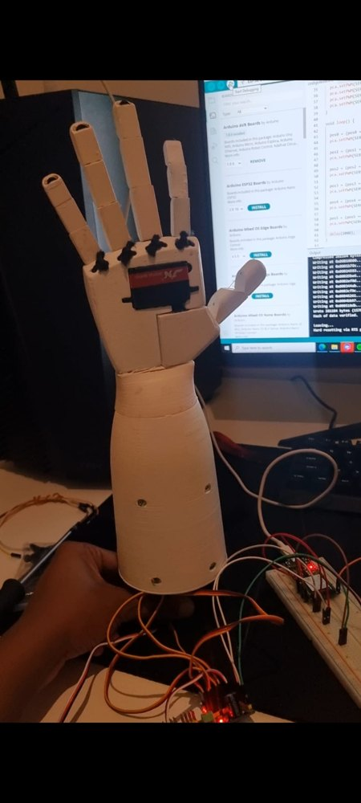
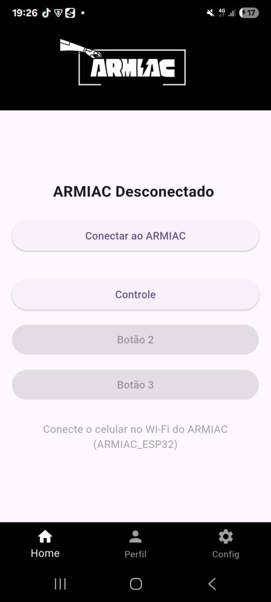
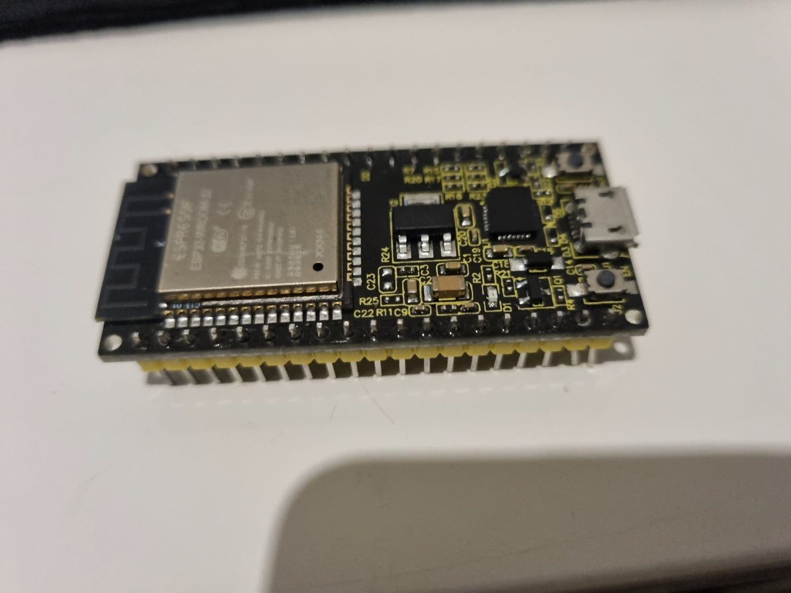
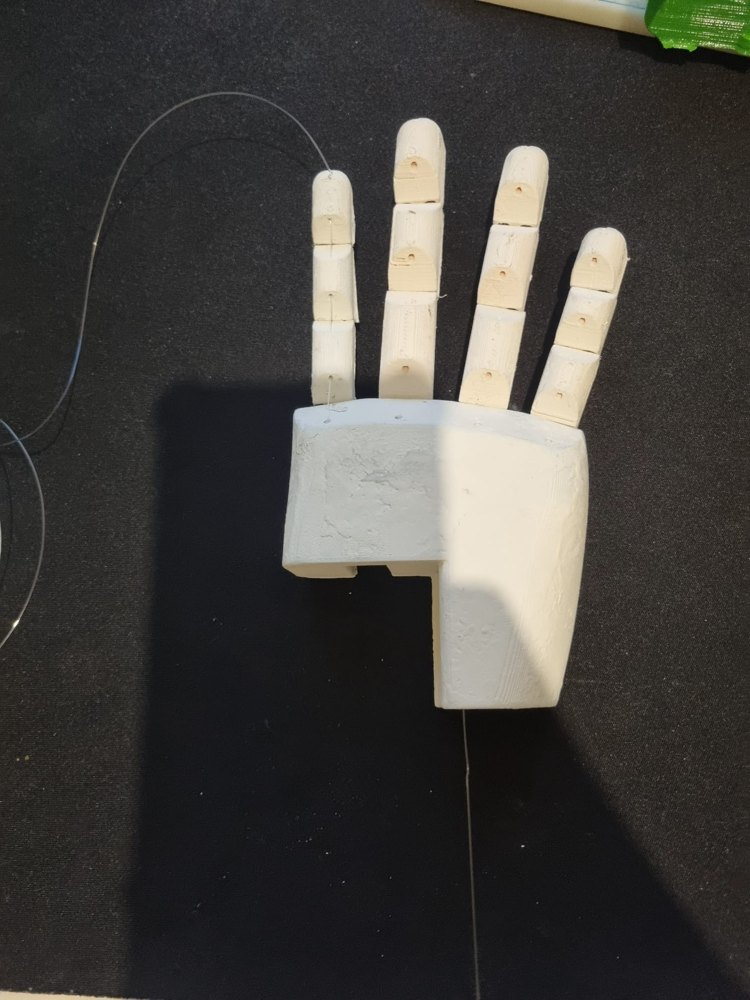
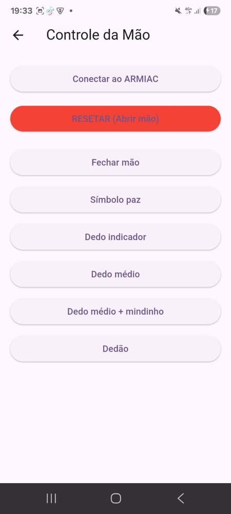
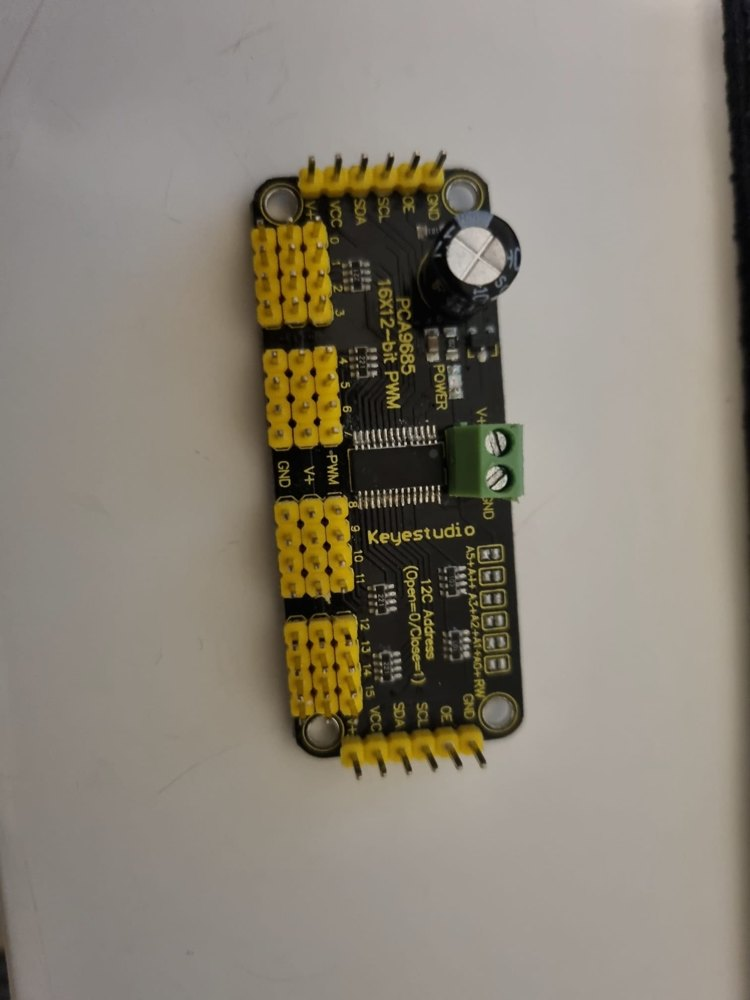

# ARMIAC — PAP

**ARMIAC — Braço Inteligente** é a minha Prova de Aptidão Profissional, desenvolvida no curso de Gestão e Programação de Sistemas Informáticos.

O projeto consiste numa mão/braço robótico controlado por uma aplicação móvel. A app foi feita em **Flutter** e comunica com um **ESP32** por Wi-Fi, através de pedidos **HTTP**. O utilizador consegue controlar a mão por botões e também por comandos de voz.

<p align="center">
  
</p>

## Estado do projeto

🚧 **Em desenvolvimento**

O protótipo já tem app, firmware, testes com servos, montagem física e vídeos de demonstração. Este repositório ainda pode receber melhorias no código, documentação técnica, diagrama de ligações e organização das peças 3D.

## Demonstrações em vídeo

| Demonstração | Link |
|---|---|
| Primeiro teste com servo | [Ver vídeo](https://youtube.com/shorts/2wemvdqr7-U?si=swo7rHpUXGU2sjMD) |
| App Flutter a controlar o protótipo | [Ver vídeo](https://youtube.com/shorts/C5wIR47ePRw?si=jKll6albw9CuomHu) |
| Montagem dos dedos e articulações | [Ver vídeo](https://www.youtube.com/shorts/j9Mxo_9-ovw) |
| Teste dos servomotores | [Ver vídeo](https://youtube.com/shorts/-pQoMxjrOXw?si=ubR13whDpzAYddDh) |

Mais detalhes: [`docs/videos.md`](docs/videos.md)

## Galeria

| Protótipo | App | Eletrónica |
|---|---|---|
|  |  |  |
|  |  |  |

## Funcionalidades principais

- Ligação ao ESP32 através da rede Wi-Fi `ARMIAC_ESP32`.
- Controlo de movimentos da mão robótica pela aplicação.
- Comandos para abrir a mão, fechar a mão, fazer sinal de paz e controlar dedos específicos.
- Reconhecimento de voz em português através da app Flutter.
- Firmware para ESP32 com servidor HTTP local.
- Controlo de vários servos através do módulo PCA9685.
- Peças físicas preparadas/impressas em 3D.

## Tecnologias usadas

- Flutter / Dart
- ESP32
- Arduino IDE
- C/C++ para Arduino
- Wi-Fi local
- HTTP
- Speech to Text
- PCA9685
- Servomotores MG996R
- Impressão 3D

## Estrutura do repositório

```text
armiac-pap/
├── app_flutter/              # Aplicação Flutter
├── firmware_esp32/           # Código do ESP32/Arduino
│   ├── armiac/               # Firmware principal
│   └── testes/               # Códigos de teste
├── assets/                   # Logótipo, imagens e galeria
│   ├── gallery/              # Fotos do protótipo, app e eletrónica
│   └── 3d/                   # Imagens/modelos visuais das peças 3D
└── docs/                     # Relatório, apresentação, vídeos e documentação
```

## Documentação

- [Relatório final em PDF](docs/relatorio-pap-final-quevin-tavares.pdf)
- [Relatório final editável](docs/relatorio-pap-final-quevin-tavares.odt)
- [Apresentação da PAP](docs/apresentacao-pap-quevin-tavares.pdf)
- [Vídeos de demonstração](docs/videos.md)
- [Materiais e componentes](docs/materiais-componentes.md)

## Como executar a aplicação Flutter

1. Instalar o Flutter.
2. Entrar na pasta da aplicação:

```bash
cd app_flutter
```

3. Instalar as dependências:

```bash
flutter pub get
```

4. Executar a aplicação:

```bash
flutter run
```

## Como carregar o firmware no ESP32

1. Abrir o ficheiro `firmware_esp32/armiac/armiac.ino` na Arduino IDE.
2. Instalar as bibliotecas necessárias:
   - `WiFi`
   - `WebServer`
   - `Wire`
   - `Adafruit PWM Servo Driver Library`
3. Selecionar a placa ESP32 correta.
4. Carregar o código para o ESP32.
5. Ligar o telemóvel/computador à rede Wi-Fi criada pelo ESP32:

```text
SSID: ARMIAC_ESP32
Password: 12345678
```

6. Abrir a app e clicar em **Conectar ao ARMIAC**.

## Endpoints do ESP32

O ESP32 cria um servidor local em:

```text
http://192.168.4.1
```

Endpoints principais:

```text
GET /ping
GET /action?a=open_hand
GET /action?a=close_hand
GET /action?a=peace
GET /action?a=close_index
GET /action?a=open_index
GET /action?a=close_middle
GET /action?a=open_middle
GET /action?a=close_ringpinky
GET /action?a=open_ringpinky
GET /action?a=close_thumb
GET /action?a=open_thumb
```

## Próximas melhorias

- Criar um diagrama de ligações do ESP32, PCA9685, fonte e servos.
- Organizar melhor os ficheiros 3D/STL, se forem adicionados ao repositório.
- Melhorar o design da app.
- Limpar código repetido na aplicação Flutter.
- Adicionar instruções de montagem passo a passo.
- Criar uma página simples de documentação ou GitHub Pages para a PAP.

## Autor

**Quévin Leonardo Aguiar Tavares**

- GitHub: [KevinLeonardoHUB](https://github.com/KevinLeonardoHUB)
- Portfólio: em desenvolvimento
